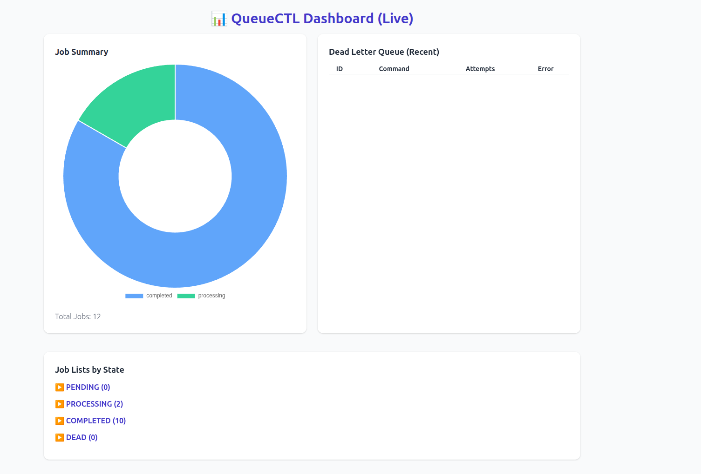

---

# 🚀 QueueCTL — Background Job Queue System
<p align="center">
  
</p>


A **CLI-based background job queue** with worker processes, automatic retries, exponential backoff, a Dead Letter Queue (DLQ), and a live monitoring dashboard.

---

## 📘 Overview

**QueueCTL** is a minimal, production-grade background job queue built in **Node.js + SQLite**.
It allows you to enqueue shell commands as jobs, execute them with multiple workers in parallel, retry on failure with exponential backoff, and manage permanently failed jobs in a **DLQ**.
A lightweight **web dashboard** (Express + Chart.js) provides live monitoring.

---

## ✨ Features

* **Persistent Job Storage:** Jobs stored in SQLite survive restarts.
* **Multiple Workers:** Parallel job execution with configurable concurrency.
* **Automatic Retries:** Failed jobs automatically retried with exponential backoff.
* **Dead Letter Queue (DLQ):** Permanently failed jobs stored for manual review or retry.
* **Configurable Settings:** Control retry count, backoff factor, timeout, etc.
* **Job Priority & Scheduling:** Enqueue with priority or delay for later execution.
* **Graceful Shutdown:** Workers complete current job before exit.
* **Live Web Dashboard:** Real-time dashboard (Express + Chart.js + TailwindCSS) to monitor jobs and DLQ.

---

## 🧱 Tech Stack

| Layer             | Technology                                |
| :---------------- | :---------------------------------------- |
| Language          | **Node.js (v20+)**                        |
| Database          | **SQLite** (via `better-sqlite3`)         |
| CLI               | `commander`                               |
| Process Execution | `child_process.spawn`                     |
| Web Dashboard     | `Express.js` + `Chart.js` + `TailwindCSS` |

---

## 📦 Installation

```bash
# 1. Clone the repository
git clone https://github.com/imbasava/
Flam-Queue_Task_Manager .git
cd queuectl

# 2. Install dependencies
npm install

# 3. Make CLI executable
chmod +x src/cli.js
```

The SQLite database initializes automatically on first use.

---

## 🚀 Getting Started

### 1️⃣ Enqueue a Job

```bash
node src/cli.js enqueue '{"command":"echo Hello from QueueCTL"}'
```

With priority:

```bash
node src/cli.js enqueue '{"command":"echo urgent task", "priority":10}'
```

With delay (seconds):

```bash
node src/cli.js enqueue '{"command":"echo delayed job", "delay":10}'
```

---

### 2️⃣ Start Workers

```bash
# Start 1 worker
node src/cli.js worker start

# Start 3 parallel workers
node src/cli.js worker start --count 3
```

Workers process jobs in parallel and handle retries automatically.

---

### 3️⃣ Manage the DLQ

```bash
# List dead jobs
node src/cli.js dlq:list

# Retry a dead job
node src/cli.js dlq:retry <job-id>
```

---

### 4️⃣ Configure Settings

```bash
# View config
node src/cli.js config:list

# Update settings
node src/cli.js config:set max-retries 3
node src/cli.js config:set backoff-base 2
node src/cli.js config:set job-timeout 60
```

---

### 5️⃣ Launch the Web Dashboard

```bash
node src/server.js
```

Then open your browser at:
👉 **[http://localhost:8080](http://localhost:8080)**

You’ll see:

* A live pie chart of job states
* Recent DLQ entries
* Expandable job lists (Pending, Processing, Completed, Dead)
* Auto-refresh every 5 seconds

---

## 🧩 Job Lifecycle

| State        | Description                         |
| :----------- | :---------------------------------- |
| `pending`    | Waiting to be picked up by a worker |
| `processing` | Currently being executed            |
| `completed`  | Successfully executed               |
| `failed`     | Failed but retryable                |
| `dead`       | Permanently failed, moved to DLQ    |

**Retry logic:**

```
delay = backoff_base ^ attempts
```

After `max_retries`, the job moves to DLQ.

---

## ⚙️ Configuration Summary

| Setting               | Description                           | Default |
| :-------------------- | :------------------------------------ | :------ |
| `max-retries`         | Max retry attempts before DLQ         | 3       |
| `backoff-base`        | Base for exponential backoff          | 2       |
| `job-timeout`         | Timeout in seconds before killing job | 60      |
| `stuck-job-threshold` | Seconds to consider a job “stuck”     | 600     |

---

## 🧱 Project Structure

```
src/
 ├── cli.js            # Main CLI entry point
 ├── db/
 │   ├── database.js   # DB initialization + migrations
 │   └── migrations.sql
 ├── storage/
 │   ├── jobs.js       # Job CRUD + DLQ logic
 │   └── config.js     # Config persistence
 ├── exec/
 │   └── runner.js     # Job execution helper
 ├── worker/
 │   ├── worker.js     # Worker loop + retry/backoff
 │   └── manager.js    # Multi-worker process manager
 ├── utils/
 │   └── logger.js     # Log helper (optional)
 └── server.js         # Express dashboard server
```

---

## 🧪 Testing Quick Flow

```bash
node src/cli.js enqueue '{"command":"echo hello"}'
node src/cli.js enqueue '{"command":"invalidcmd"}'
node src/cli.js worker start
node src/cli.js dlq:list
node src/server.js
```

✔ Jobs complete successfully
✔ Failed job retries → DLQ
✔ Data persists after restart
✔ Dashboard updates live

---

## 🧾 Submission Checklist

* [x] All required commands functional
* [x] Jobs persist after restart
* [x] Retry and backoff implemented correctly
* [x] DLQ operational
* [x] CLI user-friendly and documented
* [x] Code is modular and maintainable
* [x] Includes test script verifying main flows
* [x] Bonus: Priority, Delay, Timeout, Dashboard

---

## 📄 License

Licensed under the **MIT License** © 2025 Basavaraj Nayak.

---
